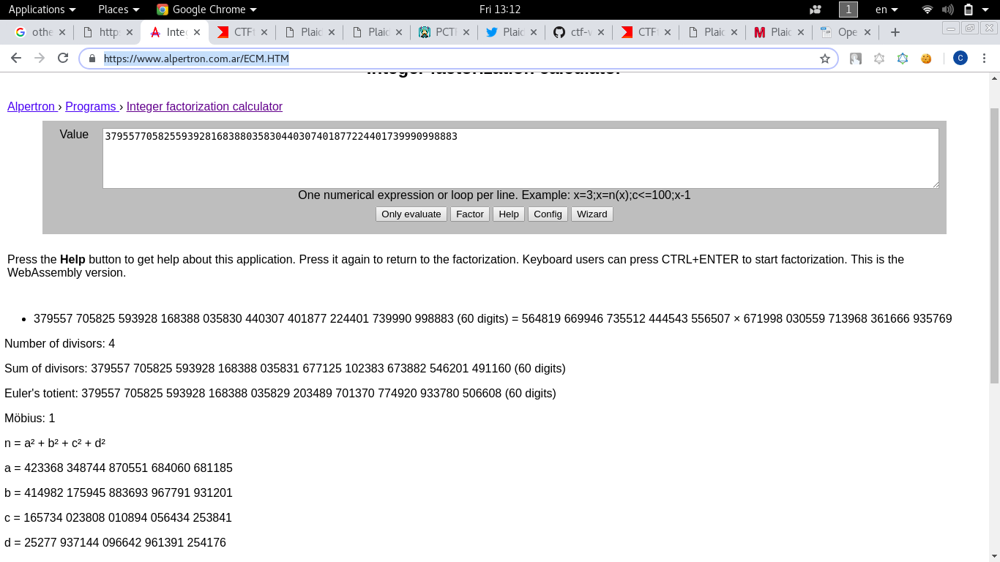

# Easy as RSA
Written by rj9

Decrypt this for a quick flag!

We got `n`,`e` and `c`
```
n: 379557705825593928168388035830440307401877224401739990998883
e: 65537
c: 29031324384546867512310480993891916222287719490566042302485
```
Using this nice website to factorize out the `p` and `q` for us


According to the RSA decryption formula:
```
n = p x q
λ(n) = (p − 1) x (q − 1)
d = e^−1 (mod λ(n))
m = c^d mod n
```
If we found `p` and `q` we can decrypt the message:

```python
from Crypto.Util.number import inverse
text = 29031324384546867512310480993891916222287719490566042302485
p = 564819669946735512444543556507
q = 671998030559713968361666935769

phi = (p-1)*(q-1)

d = inverse(65537,phi)

print hex(pow(text,d,p*q))[2:-1].decode('hex')
```
## Flag
> tjctf{RSA_2_3asy}