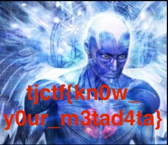

# Mind Blown
Written by rj9

One of my friends keeps sending me weird memes from his favorite subreddit but I don't quite understand this one...


Using `binwalk meme.jpg`:
```bash
# binwalk meme.jpg 

DECIMAL       HEXADECIMAL     DESCRIPTION
--------------------------------------------------------------------------------
0             0x0             JPEG image data, JFIF standard 1.01
30            0x1E            TIFF image data, big-endian, offset of first image directory: 8
202           0xCA            JPEG image data, JFIF standard 1.01
232           0xE8            TIFF image data, big-endian, offset of first image directory: 8
404           0x194           JPEG image data, JFIF standard 1.01
434           0x1B2           TIFF image data, big-endian, offset of first image directory: 8

```  
Extract using `binwalk -D='.*' meme.jpg`

The image `194` contains the flag!!



## Flag
> tjctf{kn0w_y0ur_m3tad4ta}