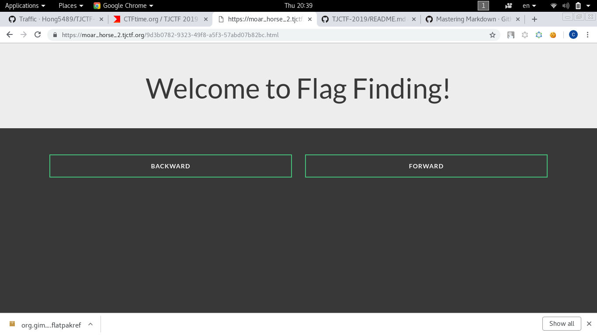

# Moar Horse 2
```
Written by okulkarni

Moar Horse is back and better than ever before! Check out this site and see if you can find the flag. It shouldn't be that hard, right?.
```
When go to the website it got two buttons, back and forward:


When I click back or forward it shows the same website but different URL:



Nothing suspicious in the source code:
```html

<html>

<head>
    <link href="/style.css" rel="stylesheet">
</head>

<body>
    <div class="jumbotron text-center">
        <div class="container">
            <h1>Welcome to Flag Finding!</h1>
        </div>
    </div>
    <div class="container">
        <div class="row">
            <div class="col-xs-6"> <a href="/a07cb0d7-df0a-4b5e-9ba3-12fc002fb71a.html" class="btn btn-sm animated-button gibson-one">Backward</a> </div>
            <div class="col-xs-6"> <a href="/967b91fc-8f75-42ea-aac3-ea3ae1a61b18.html" class="btn btn-sm animated-button gibson-two">Forward</a>
            </div>
        </div>
    </div>
</body>

</html>
```

When I keep clicking back or forward, it goes to the same URL `4b043a01-a4b7-4141-8a99-fc94fe7e3778.html`

But if I click back and forward it goes to many different URL

So I guess its like a **maze**, if you keep go back or forward you'll go back the same place

And the flag the exit for the maze

So I wrote a [script](solve.py) using Python that will automatic play the maze for me:

```python
import requests
import re
import random
path = []
url = "https://moar_horse_2.tjctf.org"
r = requests.get(url)
while(1):
	back = re.findall("/.*.html",r.text.split('\n')[14].strip())[0]
	forward = re.findall("/.*.html",r.text.split('\n')[15].strip())[0]
	if back not in path and forward not in path:
		if random.randint(0,1) == 0:
			r = requests.get(url+back)
			path.append(back)
			print back
		else:
			r = requests.get(url+forward)
			path.append(forward)
			print forward
	elif back not in path:
		r = requests.get(url+back)
		path.append(back)
		print back
	elif forward not in path:
		r = requests.get(url+forward)
		path.append(forward)
		print forward
...
...
...
```

But I realized there are many possible path when I run the code:
```
/9d3b0782-9323-49f8-a5f3-57abd07b82bc.html
/a07cb0d7-df0a-4b5e-9ba3-12fc002fb71a.html
/77504246-70cd-4501-bea2-7ca7426f55e9.html
/e140c13f-cfbb-4832-a3db-582090ec8236.html
/0f85b7d2-e3c0-4ba8-9523-b4501d0bb3fc.html
/3ec7f0d2-a4cb-471d-bc48-18b6f3401a84.html
/68f6a44e-efc6-42c5-a26c-f6cdb7fa2e06.html
/8db3e5ce-bc48-4d70-9f8c-9757b3db86c6.html
/f6f07e7e-7e36-488d-9633-d3f8e5f0de1f.html
/ea3924a9-d054-412c-ac38-218035864594.html
/cf5996c2-d90b-4c47-9c19-c417cc5aa0a1.html
/03b7f0ad-f1aa-451a-aa0d-c2b292c163ea.html
/bdf897ef-518e-4405-a4c7-e7d08d015d87.html
/3a2e1818-0424-4dcb-b801-be712f56ae82.html
/4b043a01-a4b7-4141-8a99-fc94fe7e3778.html
/e634644e-b802-496a-8bb5-0e0aac40779f.html
/f50f7e37-8ba7-43c6-9836-a6148831564e.html
/02e3d747-eb06-4483-b451-90d6cc06e8be.html
/a8db863f-aa34-41f8-aa06-879f66856f6f.html
/f9e52cea-a2e7-4b45-881f-bdddac4d13ac.html
...
...
...
/2fbcc470-0dbe-4305-9572-35ede4deb62a.html
```
So I decided to use multiple thread to check to remain unchecked path

This is my final code after alot of debuging:

```python
import requests
import re
import random
from threading import Thread
from threading import activeCount
import os
import signal

remainPath = []
url = "https://moar_horse_2.tjctf.org"
startUrl = "/4b043a01-a4b7-4141-8a99-fc94fe7e3778.html"
r = requests.get(url+startUrl)
path = []
allowed = False
def monitor():
	global allowed
	while(1):
		if activeCount() <= 600:
			allowed = True
		else:
			allowed = False

def newThread(start,r):
	while(1):
		if re.findall("tjctf{.*}",r.text):
			print start
			print re.findall("tjctf{.*}",r.text)[0]
			os.kill(os.getpid(), signal.SIGKILL)

		back = re.findall("/.*.html",r.text.split('\n')[14].strip())[0]
		forward = re.findall("/.*.html",r.text.split('\n')[15].strip())[0]
		path.append(start)
		print len(path)
		if back not in path and forward not in path:
			if allowed:
				r = requests.get(url+back)
				thread = Thread(target=newThread,args=(back,r))
				thread.start()
				r = requests.get(url+forward)
				start = forward
			else:
				if random.randint(0,1) == 0:
					r = requests.get(url+back)
					start = back
					remainPath.append(forward)
				else:
					r = requests.get(url+forward)
					start = forward
					remainPath.append(back)
		elif back not in path: 
			r = requests.get(url+back)
			start = back
		elif forward not in path:
			r = requests.get(url+forward)
			start = forward
		else:
			for rmp in remainPath:
				if allowed:
					remainPath.remove(rmp)
					r = requests.get(url+rmp)
					thread = Thread(target=newThread,args=(rmp,r))
					thread.start()
			break

monitorThread = Thread(target=monitor)
monitorThread.start()
newThread(startUrl,r)
```
Run the code, waited 5 minute. It found the flag!!
The exit is in `3cf94f73-568f-4dbc-b185-d545aff438d6.html`

```
1
2
3
4
5
6
7
8
...
...
...
18497
18498
18499
18500
18501
18502
18503
18504
18505
 1850618507

/3cf94f73-568f-4dbc-b185-d545aff438d6.html
 18508
tjctf{s0rry_n0_h0rs3s_anym0ar}
Killed
```
## Flag
> tjctf{s0rry_n0_h0rs3s_anym0ar}