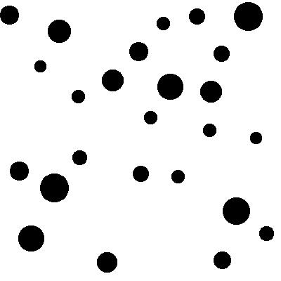
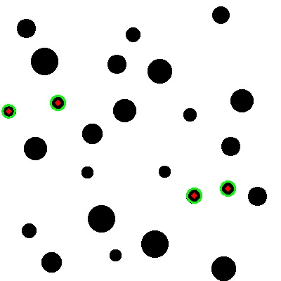
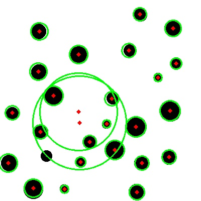
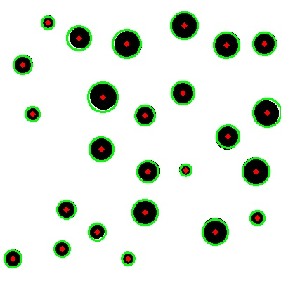

# Sight at Last
```bash
Written by jfrucht25

nc p1.tjctf.org 8005
```
When I connected I saw many lines of base64 string:
```bash
# nc p1.tjctf.org 8005
To get the flag, solve a hundred captchas in 500 seconds!
Find the minimum distance between the centers of two circles to continue:
/9j/4AAQSkZJRgABAQAAAQABAAD/2wBDAAgGBgcGBQgHBwcJCQgKDBQNDAsLDBkSEw8UHRofHh0aHBwgJC4nICIsIxwcKDcpLDAxNDQ0Hyc5PTgyPC4zNDL/2wBDAQkJCQwLDBgNDRgyIRwhMjIyMjIyMjIyMjIyMjIyMjIyMjIyMjIyMjIyMjIyMjIyMjIyMjIyMjIyMjIyMjIyMjL/wAARCAGQAZADASIAAhEBAxEB/8QAHwAAAQUBAQEBAQEAAAAAAAAAAAECAwQFBgcICQoL/8QAtRAAAgEDAwIEAwUFBAQAAAF9AQIDAAQRBRIhMUEGE1FhByJxFDKBkaEII0KxwRVS0fAkM2JyggkKFhcYGRolJicoKSo0NTY3ODk6Q0RFRkdISUpTVFVWV1hZWmNkZWZnaGlqc3R1dnd4eXqDhIWGh4iJipKTlJWWl5iZmqKjpKWmp6ipqrKztLW2t7i5usLDxMXGx8jJytLT1NXW19jZ2uHi4+Tl5ufo6erx8vP09fb3+Pn6/8QAHwEAAwEBAQEBAQEBAQAAAAAAAAECAwQFBgcICQoL/8QAtREAAgECBAQDBAcFBAQAAQJ3AAECAxEEBSExBhJBUQdhcRMiMoEIFEKRobHBCSMzUvAVYnLRChYkNOEl8RcYGRomJygpKjU2Nzg5OkNERUZHSElKU1RVVldYWVpjZGVmZ2hpanN0dXZ3eHl6goOEhYaHiImKkpOUlZaXmJmaoqOkpaanqKmqsrO0
...
...
...
AUUUUAFFFFABRRRQAUUUUAf/9k=
>>> 
```
Using `base64 -d` command you can decode the base64:

`echo "/9j/4AAQSkZJRgABAQAAAQABAAD/2wBDAAgGBgcGBQgHBwcJCQgKDBQNDAsLDB..." | base64 -d`

And redirect it to a file:

`echo "/9j/4AAQSkZJRgABAQAAAQABAAD/2wBDAAgGBgcGBQgHBwcJCQgKDBQNDAsLDB..." | base64 -d > file`

Using `file "file"` to identify what file is this:

```bash
file file
file: JPEG image data, JFIF standard 1.01, aspect ratio, density 1x1, segment length 16, baseline, precision 8, 400x400, frames 3
```
And its a image that has alot of black circle with white backgroud:



The connection said `Find the minimum distance between the centers of two circles to continue:`

So I guess we need to find distance in **pixel** between each circles and find the minimum one

And It also stated `solve a hundred captchas in 500 seconds`

**That is impossible for human!** We must write a script that can do this job for us

After some research, we found **OpenCV** has a function that can detect circles in an image

## Resources
[Detecting Circles in Images using OpenCV and Hough Circles](https://www.pyimagesearch.com/2014/07/21/detecting-circles-images-using-opencv-hough-circles/)

[Hough Circle Transform](https://opencv-python-tutroals.readthedocs.io/en/latest/py_tutorials/py_imgproc/py_houghcircles/py_houghcircles.html)

### Decode base64 and save the image to test.jpg
```python
s = remote('p1.tjctf.org',8005)
print s.recvuntil("Find the minimum distance between the centers of two circles to continue:\n")
text = s.recvuntil("\n>>>")[:-4].decode('base64')
open('test.jpg','w').write(text)
```
### Using OpenCV libraries to detect circles
```python
img = cv2.imread('test.jpg',0)
img = cv2.medianBlur(img,5)
cimg = cv2.cvtColor(img,cv2.COLOR_GRAY2BGR)

circles = cv2.HoughCircles(img,cv2.HOUGH_GRADIENT,1,20,
                            param1=50,param2=30,minRadius=0,maxRadius=0)
circles = np.uint16(np.around(circles))
for i in circles[0,:]:
    # draw the outer circle
    cv2.circle(cimg,(i[0],i[1]),i[2],(0,255,0),2)
    # draw the center of the circle
    cv2.circle(cimg,(i[0],i[1]),2,(0,0,255),3)
```
### Show the after detecting
```python
cv2.imshow('detected circles',cimg)
cv2.waitKey(0)
cv2.destroyAllWindows()
```
But It only detected 4 circles =(



After I changing the `param2` to 20 the result improved

But also detected not the circle I wanted:


After alots of trial and errors (Changing the `param1` and `param2`) , I finally got a nice output:


Using the Distance formula to calculate distance in terms of pixel:

`distance = sqrt((x1 - x2) + (y1 - y2))`

After few hours of struggle, I finally solve this!!

It needs very precise distance in decimal and the difference between the actual distance can't more than 1:
```
>>> a
Traceback (most recent call last):
  File "/home/app/run.py", line 43, in <module>
    main()
  File "/home/app/run.py", line 28, in main
    if not checkcaptcha():
  File "/home/app/run.py", line 20, in checkcaptcha
    return abs(float(input('>>> ').strip()) - dist) < 1
```

So I scale up the orginal image to 300% to get precise distance:
```python
from PIL import Image
image = Image.open('test.jpg')
image = image.resize((image.width*3,image.height*3),Image.ANTIALIAS)
image.save('test.jpg')
```

And run it in a infinity loop, if it failed it will restart:
```python
s = remote('p1.tjctf.org',8005)
while(1):
	try:
		...
		...
		...
	except:
		s.close()
		s = remote('p1.tjctf.org',8005)
```
[Final Solution](solve.py)

Result:
```
Find the minimum distance between the centers of two circles to continue:

43.0464865000617678 98
 Correct! You have 419.3 seconds left.

Find the minimum distance between the centers of two circles to continue:

41.40048308896890461 99
 Correct! You have 418.4 seconds left.

Nice! Your flag is:  tjctf{i5_th1s_c0mput3r_v1si0n?}
```
## Flag
> tjctf{i5_th1s_c0mput3r_v1si0n}